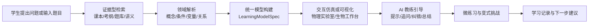
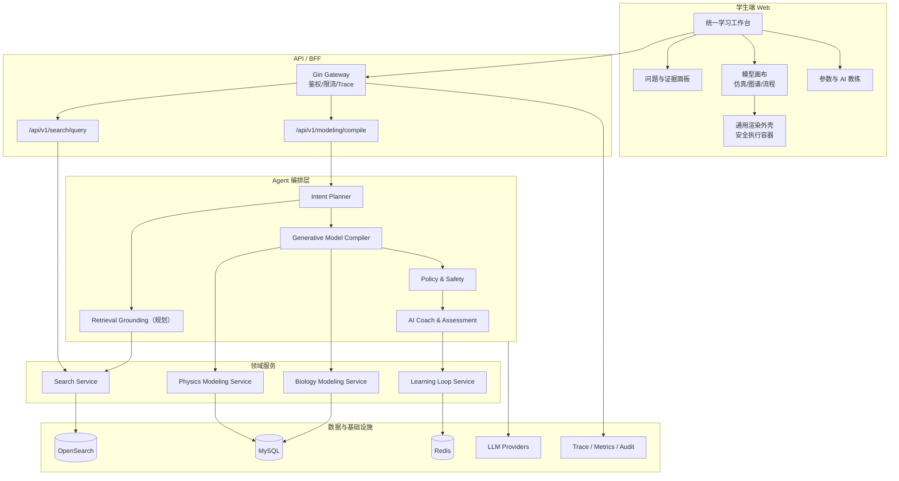

# Snowy v2 重构建议：面向高中生的 AI 科学建模与交互仿真实验室

> 历史设计说明：本文是 v2 阶段的产品与技术设想，包含检索增强、资料索引、参考信息组织等规划能力；不代表当前默认运行链路已经接入资料检索。当前默认问答链路为 LLM 直答 + runtime grounding。

## 1. 文档信息

- 产品名称：Snowy
- 文档类型：v2 重构建议 / 完整评审版
- 目标读者：产品、研发、AI、教研、测试、运营与评审人员
- 当前版本：v1.0
- 更新时间：2026-05-02
- 文档范围：仅提出新版软件改进建议与落地方案，不替代现有 MVP PRD 与技术方案

---

## 2. 执行摘要

当前 Snowy 已具备面向高中生的 AIGC 学习平台雏形：统一资料索引规划、物理 / 3D 场景代码生成、生物结构化建模，以及基于 Go + Gin + Eino + OpenSearch 的工程基座。v2 的核心建议不是简单增加功能，而是将产品从“AI 问答 + 代码生成 + 图谱输出”的组合，重构为一个统一的 **AI 科学建模与交互仿真实验室**。

新版 Snowy v2 建议围绕一条稳定学习链路组织能力：

```text
提问 → 组织参考信息 → 构建模型 → 交互仿真/可视化 → 反思归纳 → 练习验证
```

对应产品定位升级为：

> Snowy v2 是面向高中生的 AIGC 资料索引规划、物理仿真与生物可视化统一建模工具。它以课标与可信资料为依据，以大模型推理生成的结构化模型为中间层，以可交互仿真和可视化为学习载体，帮助学生把“知识点、题目条件、变量关系、过程变化和解题迁移”连接起来。

关键重构方向：

1. **资料索引规划升级为证据型学习搜索**：从“返回答案”升级为“基于引用、知识图谱、易错点、题型映射和下一步建议的学习入口”。
2. **物理建模升级为 AI 生成式物理仿真实验室**：从“生成前端代码并渲染”升级为“大模型推理生成仿真逻辑 + 通用渲染外壳 + 任务挑战 + 即时反馈”。
3. **生物建模升级为生命过程可视化工作台**：从“关系抽取与流程图”升级为“概念关系、过程阶段、实验变量、动态机制和变量影响联动”。
4. **新增统一学习工作台**：以“问题与证据 + 模型画布 + 参数/解释/AI 教练”三栏布局承载跨学科学习闭环。
5. **AI 架构转向大模型推理优先的生成式建模**：让大模型尽可能输出物理仿真逻辑、生物过程关系、交互任务、评估题和可视化结构；通用渲染外壳只负责安全执行、展示和日志。

---

## 3. 项目背景与现状诊断

### 3.1 已有基础能力

根据当前仓库文档，Snowy MVP 已形成以下能力基础：

| 方向 | 当前能力 | v2 可继承价值 |
|---|---|---|
| 资料索引规划 | 规划中统一索引课本、考纲、题库、讲义，并基于规划中的资料召回增强输出答案与引用 | 可作为 v2 的证据层与学习入口 |
| 物理 / 3D 场景 | 题干解析、条件抽取、公式推导、前端代码生成、浏览器沙箱渲染 | 可作为 v2 物理仿真能力的原型 |
| 生物建模 | 概念识别、关系抽取、过程拆解、实验变量分析 | 可作为 v2 生物可视化与实验推理的原型 |
| Agent 编排 | 基于 Eino Graph 进行意图识别、工具调用、多模型路由 | 可继续作为 v2 AI 编排控制层 |
| 工程基座 | Go、Gin、OpenSearch、MySQL、Redis、Next.js、iframe sandbox | 可继续复用，重点增强大模型推理链路、领域校验与通用渲染基础设施 |

### 3.2 当前主要问题

#### 3.2.1 三类能力仍偏“模块并列”，缺少统一学习体验

当前信息架构将资料索引规划、物理建模、生物建模拆成独立入口，有利于 MVP 快速验证，但对高中生而言，真实学习路径往往不是按功能模块切换，而是围绕一个问题不断深入：

- 先查概念；
- 再看公式或过程；
- 再通过图像、仿真或实验变量理解变化；
- 最后回到题型和练习验证。

因此 v2 需要以“问题驱动的统一学习工作台”取代“功能驱动的页面拼接”。

#### 3.2.2 建模主路径需要从“写代码或套预设”升级为“大模型推理生成”

MVP 方案强调大模型生成 React / HTML / CSS / JS，并通过 AST 校验与浏览器沙箱运行。该路径适合探索，但作为高中生长期使用的学习产品，直接输出完整可执行代码存在稳定性、安全性和教学一致性风险；同时，如果过度依赖预设学科组件，又会限制 AIGC 的开放建模能力，难以覆盖学生临场提出的多样问题。

v2 应采用“大模型推理优先”的折中路线：

1. **主产物是生成式模型包**：大模型基于参考信息和题意，输出公式、变量、过程、关系、交互任务、反馈规则和评估题。
2. **代码与 DSL 是受控载体**：需要动态效果时，可生成受限 DSL、可执行片段或可视化规格，但必须通过 schema、领域规则和安全沙箱校验。
3. **渲染层不固化学科逻辑**：前端只提供画布、坐标系、图谱布局、参数控件、动画循环、日志和错误回传等基础设施。
4. **参数变化分级处理**：只影响数值的变化可本地重算；影响解释、模型结构、变量关系或学习反馈时，应触发大模型再推理。

#### 3.2.3 游戏化体验不足，难以形成持续探索动机

当前物理 / 3D 场景强调“渲染”和“参数调节”，但游戏领域经验表明，仅有可视化还不等于有效互动。高中生需要明确目标、即时反馈、挑战梯度和失败后的修正路径。

v2 的游戏化应围绕学习目标设计，而不是简单加入积分、徽章或排行榜：

- 任务目标：例如“调节初速度让小球命中目标”；
- 反馈闭环：参数改变后立即显示轨迹、误差、公式项变化；
- 失败可解释：不只提示错，还指出变量关系和模型假设；
- 迁移挑战：从演示题过渡到变式题。

#### 3.2.4 生物建模需要从静态关系图升级为动态机制理解

高中生物的难点不只是记住概念，而是理解“结构—过程—变量—结果”的链条。例如光合作用并非单个关系，而是光照强度、CO₂ 浓度、温度、酶活性、光反应、暗反应、有机物积累之间的动态机制。

v2 应在概念图、流程图基础上，进一步支持：

- 阶段切换：光反应 / 暗反应、DNA 复制 / 转录 / 翻译；
- 限制因素：哪个变量在当前条件下成为主要限制；
- 实验变量：自变量、因变量、控制变量、无关变量；
- 曲线解释：变量变化如何对应图像拐点、平台期和趋势。

#### 3.2.5 学习闭环和评价体系仍偏弱

现有学习闭环包含历史、收藏、继续追问，但还没有形成完整的“学会了吗”的验证机制。v2 应补足：

- 微练习：围绕当前模型自动生成 1~3 个检查题；
- 反思卡：让学生总结变量关系和适用条件；
- 错因归类：公式误用、单位错误、变量控制错误、概念混淆；
- 学习证据：记录学生是否完成交互、是否修正错误、是否能迁移到变式题。

---

## 4. Snowy v2 产品定位

### 4.1 一句话定位

**Snowy v2 是一个面向高中生的 AI 科学建模与交互仿真实验室，将可信资料索引规划、物理仿真、生物可视化和学习验证整合到同一学习工作台。**

### 4.2 核心价值主张

| 价值 | 含义 | 对学生的收益 |
|---|---|---|
| 可信 | 关键结论来自课本、考纲、题库、讲义等可追溯证据 | 避免“AI 胡说”，知道答案来自哪里 |
| 可解释 | 每个模型、公式、变量关系都给出高中生可理解的说明 | 不只看结论，理解为什么 |
| 可交互 | 通过参数调节、动画、图像、图谱观察变化 | 抽象知识变成可操作经验 |
| 可验证 | 提供微练习、反思题和变式挑战 | 检查是否真正学会 |
| 可迁移 | 从知识点连接到题型、实验和跨情境应用 | 提升解题迁移能力 |

### 4.3 目标学习链路



### 4.4 设计原则

1. **证据先于生成**：任何知识性结论必须优先绑定引用来源。
2. **推理先于渲染**：建模逻辑尽可能由大模型基于证据推理生成，渲染层只提供通用画布、控件、沙箱和日志能力。
3. **交互服务理解**：参数、动画、关卡和反馈必须指向明确学习目标。
4. **高中课标优先**：默认表达保持在高中认知范围内，超纲内容需显式标记。
5. **失败也要可学习**：低可信、条件不足、模型不适用时，应给出可理解的补充路径。

---

## 5. 产品功能重构建议

### 5.1 统一学习工作台

v2 建议新增统一学习工作台，作为资料索引规划、物理仿真、生物可视化的共同承载界面。

#### 5.1.1 推荐布局

| 区域 | 内容 | 作用 |
|---|---|---|
| 左侧：问题与证据 | 用户问题、检索引用、知识标签、题型入口 | 保证所有学习从可信来源出发 |
| 中间：模型画布 | 物理仿真、3D/2D 可视化、生物流程图、概念图 | 承载主要理解活动 |
| 右侧：参数与 AI 教练 | 参数面板、推导步骤、变量解释、提示、微练习 | 引导探索、纠错和总结 |
| 底部：学习进度 | 当前目标、已完成交互、下一步建议 | 形成闭环与成就感 |

#### 5.1.2 工作台模式

- `Search Mode`：证据型学习搜索，以答案、引用、知识图谱、题型映射为主。
- `Physics Lab Mode`：物理仿真实验室，以任务、参数、轨迹、矢量、曲线和推导为主。
- `Biology Visual Mode`：生物可视化工作台，以概念关系、过程阶段、变量影响和实验设计为主。
- `Review Mode`：复盘模式，以错因、总结、变式练习和收藏为主。

### 5.2 资料索引规划升级：证据型学习搜索

#### 5.2.1 改进目标

将资料索引规划从“问答入口”升级为“学习导航入口”。学生不只获得答案，还能知道：

- 这个问题属于哪个章节和知识点；
- 答案来自哪些可信资料；
- 容易错在哪里；
- 典型题型如何考；
- 是否适合进入物理仿真或生物可视化。

#### 5.2.2 输出结构建议

| 输出块 | 说明 |
|---|---|
| 一句话结论 | 用高中生能读懂的语言先给核心结论 |
| 参考信息 | 规划中展示课本 / 考纲 / 讲义 / 题库片段与来源 |
| 知识点图谱 | 当前概念与前置/后续知识点关系 |
| 公式或规律卡 | 适用条件、常见变量、单位、限制条件 |
| 易错点 | 概念混淆、公式误用、图像误读、实验变量混淆 |
| 题型映射 | 选择题、计算题、实验题、图像题等典型考法 |
| 下一步建议 | 进入仿真、查看变式题、复习前置知识 |

#### 5.2.3 示例

用户输入：`牛顿第二定律在斜面题中怎么用`

v2 应返回：

- 结论：沿斜面方向建立坐标轴，把合力写成 `ma`；
- 引用：课本关于牛顿第二定律、受力分析、斜面模型的相关片段；
- 条件：是否光滑、有无摩擦、是否受外力、是否连接绳或滑轮；
- 易错点：把重力直接写成 `mg` 作为沿斜面合力、漏掉支持力方向、摩擦方向判断错误；
- 建模入口：进入斜面受力仿真，调节角度和摩擦因数观察加速度变化。

### 5.3 物理建模升级：AI 生成式物理仿真实验室

#### 5.3.1 改进目标

将“物理 / 3D 场景代码生成”升级为“面向高中物理模型的 AI 生成式交互仿真实验室”。大模型负责理解题意、抽取变量、推导公式、生成仿真逻辑、挑战目标、反馈规则和解释文本；前端或后端运行时只负责解释执行结构化规格、绘制图形、隔离风险和记录日志。

#### 5.3.2 首批推荐生成式模型任务

| 模型 | 学习目标 | 交互参数 | 可视化元素 | 游戏化任务 |
|---|---|---|---|---|
| 匀变速直线运动 | 理解位移、速度、加速度关系 | 初速度、加速度、时间 | x-t / v-t 图像、运动轨迹 | 调参让小车在指定时间到达终点 |
| 平抛运动 | 理解水平和竖直方向独立性 | 初速度、高度、重力加速度 | 轨迹、速度分解、落点 | 调节初速度命中目标区 |
| 斜面受力 | 理解重力分解、摩擦和加速度 | 斜面角、摩擦因数、质量 | 受力箭头、加速度、分力 | 判断物体是否下滑并验证 |
| 弹簧振子 | 理解回复力、周期、能量转换 | 质量、劲度系数、振幅 | 位移曲线、能量柱状图 | 找到让周期达到目标值的参数 |
| 功和能 | 理解动能、势能、机械能守恒 | 高度、速度、摩擦 | 能量柱、轨迹、损耗 | 让小球刚好越过障碍 |

#### 5.3.3 游戏化设计原则

游戏化应围绕学习行为，而非单纯奖励：

1. **目标清晰**：每个仿真给出一个可达成目标，如命中、到达、保持平衡、解释曲线。
2. **反馈即时**：参数变化后即时刷新结果、误差、趋势和公式项。
3. **难度递进**：从单变量探索到多变量综合，再到题目变式。
4. **错误可解释**：失败后解释是公式、单位、方向、条件还是变量控制问题。
5. **迁移验证**：完成仿真后给出相似题或变式挑战。

#### 5.3.4 推荐交互反馈

- 轨迹反馈：展示真实轨迹、预测轨迹、目标区和误差距离。
- 矢量反馈：展示速度、加速度、力、分力方向与大小。
- 图像反馈：同步展示 x-t、v-t、a-t 或能量曲线。
- 公式反馈：高亮受参数影响的公式项。
- 结论反馈：用一句话总结“当 X 增大时，Y 如何变化，原因是什么”。

### 5.4 生物建模升级：生命过程可视化工作台

#### 5.4.1 改进目标

将生物建模从“概念识别 + 关系图”升级为“由大模型推理驱动的生命过程结构化、动态化、实验化理解工具”。

#### 5.4.2 首批推荐主题

| 主题 | 可视化重点 | 变量分析重点 | 典型学习任务 |
|---|---|---|---|
| 光合作用与细胞呼吸 | 光反应/暗反应、呼吸阶段、物质能量变化 | 光照强度、CO₂、温度、酶活性 | 判断限制因素并解释曲线 |
| 遗传基本规律 | 亲子代表现型、基因型推演、分离/自由组合 | 显隐性、亲本组合、概率 | 构建遗传图解并计算比例 |
| 生态系统 | 能量流动、物质循环、食物网 | 营养级、生物量、能量传递效率 | 调整种群数量观察连锁影响 |
| 细胞结构与物质运输 | 细胞器关系、跨膜运输方式 | 浓度差、载体、能量 | 判断运输方式与条件 |
| 实验设计基础 | 实验组/对照组、变量控制 | 自变量、因变量、控制变量 | 修正不规范实验设计 |

#### 5.4.3 通用生物可视化基础组件

- **概念图容器**：展示由大模型推理生成的核心概念、前置概念、易混概念。
- **流程图容器**：展示由大模型推理生成的生命过程阶段、输入输出和关键条件。
- **变量影响图容器**：展示由大模型推理生成的因素影响、促进/抑制、限制、阈值和平台期。
- **实验设计卡容器**：展示由大模型推理生成的自变量、因变量、控制变量、对照组和实验组拆解。
- **曲线解释容器**：承载大模型生成的拐点、平台期、最适点与生物机制解释。

#### 5.4.4 示例

用户输入：`光照强度如何影响有机物积累`

v2 应输出：

- 概念：光照强度、光反应、暗反应、CO₂ 浓度、有机物积累、呼吸消耗；
- 关系：光照增强通常提高光反应速率，但在 CO₂ 或温度限制下会出现平台期；
- 过程：光能吸收 → ATP/NADPH 形成 → 暗反应合成有机物 → 与呼吸消耗共同决定净积累；
- 变量：自变量为光照强度，因变量为有机物积累量，控制变量为温度、CO₂ 浓度、植物状态等；
- 可视化：由大模型生成光照强度—净光合速率曲线语义、限制因素提示、实验变量卡，再由通用图谱与曲线容器展示。

### 5.5 学习闭环增强

v2 建议新增四类学习闭环能力：

| 能力 | 说明 |
|---|---|
| 微练习 | 每次检索或建模后生成 1~3 道针对性检查题 |
| 反思总结 | 让学生用一句话总结变量关系、适用条件或过程机制 |
| 错因归类 | 将错误归为概念混淆、公式误用、单位错误、变量控制错误等 |
| 下一步路径 | 根据当前表现推荐复习前置知识、进入仿真、做变式题或收藏复盘 |

---

## 6. 统一建模架构建议

### 6.1 核心转变：大模型推理优先的生成式建模

v2 的核心不是把所有问题映射到预置组件，而是让大模型尽可能承担“建模推理”本身：从证据中抽取约束，从题意中识别变量和目标，再生成可校验、可执行、可解释的模型包。推荐路径如下：

```text
用户问题
  → 规划中的资料召回
  → 领域解析与课标约束
  → LLM 生成 GenerativeModelSpec
  → 领域规则校验与安全校验
  → 通用渲染外壳解释执行
  → 参数交互、本地重算或大模型再推理
  → 学习反馈与微练习
```

这一路线遵循四个原则：

- **LLM Reasoning First**：组织参考信息后，由大模型生成完整建模包，具体公式、变量关系、过程阶段、挑战目标和反馈文案尽可能来自模型推理。
- **Model Spec as Contract**：大模型输出仍必须结构化，便于 schema 校验、领域校验、渲染解释、缓存复用和审计追踪。
- **Renderer as Infrastructure**：渲染器只负责安全执行与展示，提供画布、坐标系、图谱布局、控件、动画循环、沙箱和日志，不固化主要学科逻辑。
- **Validator as Guardrail**：领域校验器负责拒绝错误模型、提示低可信、要求补充条件或触发大模型再推理。

### 6.2 统一生成式模型包

建议将原 `UnifiedModelPackage` 升级为偏大模型推理输出的 `GenerativeModelPackage`。它仍是统一协议，但重点表达“大模型推理生成了什么、依据是什么、如何校验、如何渲染、何时再推理”。

```text
GenerativeModelPackage
├── LearningModelSpec          # 学习目标、学科、年级、知识标签
├── EvidenceRef[]              # 参考信息与 grounding 片段
├── ReasoningTrace             # 可展示的关键推理链摘要，不暴露敏感系统提示
├── GenerativeModelSpec        # 大模型生成的统一建模结果
├── DynamicSimulationSpec      # 物理/数学类动态仿真逻辑，可选
├── GenerativeVisualizationSpec# 生物/知识图谱/流程可视化结构，可选
├── InteractionPlan            # 参数面板、挑战目标、反馈规则、再推理触发条件
├── AssessmentTask[]           # 微练习、反思题、变式题
├── ModelValidationReport      # schema、领域、安全、可信度校验结果
├── RegenerationHint[]         # 低可信或条件变化时的再推理建议
└── Warning[]                  # 低可信、超纲、条件不足、模型假设
```

### 6.3 关键类型建议

#### 6.3.1 `ReasoningTrace`

```json
{
  "summary": "根据引用可知，平抛运动可分解为水平方向匀速运动和竖直方向自由落体运动。",
  "evidence_used": ["textbook_physics_b1_ch3_sec2"],
  "assumptions": ["忽略空气阻力", "重力加速度恒定", "抛出方向水平"],
  "key_steps": [
    "识别目标量为水平位移",
    "用竖直方向求落地时间",
    "用水平方向速度乘时间求水平位移"
  ],
  "confidence": 0.92
}
```

#### 6.3.2 `GenerativeModelSpec`

```json
{
  "id": "gms_20260502_001",
  "domain": "physics",
  "grade_band": "high_school",
  "topic": "projectile_motion",
  "learning_goal": "理解平抛运动中水平和竖直方向的独立性",
  "knowledge_tags": ["平抛运动", "运动的合成与分解", "匀变速运动"],
  "entities": [
    {"id": "ball", "name": "小球", "type": "object"},
    {"id": "ground", "name": "地面", "type": "reference"}
  ],
  "variables": [
    {"name": "v0", "label": "初速度", "unit": "m/s", "default": 20, "min": 0, "max": 60},
    {"name": "h", "label": "抛出高度", "unit": "m", "default": 20, "min": 1, "max": 80}
  ],
  "relations": [
    {"source": "h", "target": "t", "type": "determines", "description": "高度决定落地时间"},
    {"source": "v0", "target": "x", "type": "proportional", "description": "高度不变时，初速度越大，水平位移越大"}
  ]
}
```

#### 6.3.3 `DynamicSimulationSpec`

```json
{
  "simulation_type": "generated_projectile_2d",
  "runtime": "safe_math_dsl",
  "assumptions": ["忽略空气阻力", "重力加速度恒定"],
  "state_variables": ["x", "y", "vx", "vy", "t"],
  "formulas": [
    {"id": "x_t", "expr": "x = v0 * t", "meaning": "水平位移"},
    {"id": "y_t", "expr": "y = h - 0.5 * g * t^2", "meaning": "竖直位置"},
    {"id": "t_fall", "expr": "sqrt(2 * h / g)", "meaning": "落地时间"}
  ],
  "render_instructions": {
    "coordinate_system": "2d_cartesian",
    "layers": ["trajectory", "velocity_vector", "axis", "target_zone"],
    "annotations": ["水平速度保持不变", "竖直速度随时间增大"]
  },
  "local_recompute_allowed": true,
  "regenerate_when": ["新增空气阻力", "改变抛出方向", "要求解释曲线拐点"]
}
```

#### 6.3.4 `GenerativeVisualizationSpec`

```json
{
  "visualization_type": "generated_biology_process_graph",
  "topic": "photosynthesis",
  "nodes": [
    {"id": "light", "label": "光照强度", "type": "factor"},
    {"id": "light_reaction", "label": "光反应", "type": "process"},
    {"id": "organic", "label": "有机物积累", "type": "result"}
  ],
  "edges": [
    {"source": "light", "target": "light_reaction", "relation": "promotes", "evidence_ref": "bio_textbook_ch5"},
    {"source": "light_reaction", "target": "organic", "relation": "influences", "condition": "CO₂ 与温度不成为限制因素"}
  ],
  "process_steps": [
    {"index": 1, "title": "光能吸收", "input": ["光"], "output": ["ATP", "NADPH"]},
    {"index": 2, "title": "暗反应合成", "input": ["CO₂", "ATP", "NADPH"], "output": ["有机物"]}
  ],
  "curve_explanation": "光照较弱时光照是主要限制因素；光照继续增强后，CO₂ 浓度或温度可能成为限制因素，曲线进入平台期。"
}
```

#### 6.3.5 `InteractionPlan`

```json
{
  "controls": [
    {"variable": "v0", "control": "slider", "label": "调节初速度"},
    {"variable": "h", "control": "slider", "label": "调节抛出高度"}
  ],
  "challenge": {
    "goal": "调节初速度让小球落入目标区",
    "success_condition": "abs(x_final - target_x) <= 0.5",
    "feedback_generated_by_llm": true
  },
  "feedback_rules": [
    {"when": "x_final < target_x", "message": "落点偏近，尝试增大初速度。"},
    {"when": "student_claims_time_depends_on_v0", "action": "trigger_llm_explanation"}
  ],
  "regeneration_policy": {
    "local_recompute": ["v0", "h", "g"],
    "llm_regenerate": ["new_force", "new_medium", "new_learning_goal", "conflicting_student_explanation"]
  }
}
```

#### 6.3.6 `ModelValidationReport`

```json
{
  "schema_valid": true,
  "evidence_valid": true,
  "domain_valid": true,
  "safety_valid": true,
  "checks": [
    {"name": "unit_consistency", "status": "pass"},
    {"name": "formula_scope", "status": "pass"},
    {"name": "grade_boundary", "status": "pass"}
  ],
  "confidence": 0.91,
  "fallback_required": false
}
```

### 6.4 通用渲染外壳与安全执行容器

前端仍需要基础组件，但它们不承载主要学科建模逻辑，而是解释执行大模型生成的结构化规格：

| 渲染基础设施 | 用途 | 输入 |
|---|---|---|
| `Coordinate2DCanvas` | 坐标系、轨迹、点、线、区域绘制 | `DynamicSimulationSpec.render_instructions` |
| `VectorOverlay` | 力、速度、加速度、分力箭头 | 大模型生成的向量语义与数值 |
| `CurvePanel` | x-t、v-t、能量、光合速率等曲线 | 公式 DSL 或曲线语义 |
| `GraphCanvas` | 概念图、关系图、食物网 | `GenerativeVisualizationSpec.nodes/edges` |
| `ProcessTimeline` | 生命过程、实验步骤、阶段切换 | 大模型生成的过程阶段 |
| `VariableCardPanel` | 自变量、因变量、控制变量、参数控件 | `InteractionPlan.controls` |
| `SafeCodeSandbox` | 低风险动态片段隔离运行 | 通过校验的 DSL 或代码片段 |

AI 生成的 DSL 或代码片段可用于增强动态表现，但必须满足：

- 引用 grounding 充分；
- 输出 schema 合法；
- 通过物理或生物领域规则校验；
- 通过依赖白名单、AST、沙箱和审计；
- 失败时可触发再推理或降级为证据解释。

## 7. AI 与工程架构建议

### 7.1 技术基座保留

v2 建议继续复用当前技术栈：

- 后端：Go + Gin；
- Agent 编排：Eino Graph；
- 检索：OpenSearch 全文 + 向量 + 混合检索；
- 存储：MySQL + Redis；
- 异步任务：Asynq；
- 前端：Next.js + React + TypeScript；
- 可视化：Canvas / SVG / React Flow / Three.js 作为通用渲染外壳与安全执行容器；
- 安全沙箱：iframe sandbox + postMessage，作为生成式 DSL / 代码片段的隔离执行层。

### 7.2 新增或强化的核心子系统

| 子系统 | 作用 | 建议归属 |
|---|---|---|
| Domain Parser | 识别学科、章节、题型、概念、变量、条件 | Agent / Modeling |
| Generative Model Compiler | 调用大模型将组织参考信息和领域解析结果编译为生成式模型包 | Modeling Core |
| Physics Rule Validator | 校验公式、单位、变量范围、模型假设 | Physics Service |
| Biology Relation Validator | 校验概念关系、过程顺序、实验变量 | Biology Service |
| Render Runtime Registry | 管理通用渲染外壳、基础组件、版本、输入 schema 与安全策略 | Frontend + Backend Metadata |
| Learning Assessment Engine | 生成微练习、反思题、错因分类和下一步建议 | Agent / Learning |
| Quality & Audit Center | 记录引用、模型路由、校验结果、低可信回退 | Infra / Observability |

### 7.3 v2 架构总览



### 7.4 Agent 链路调整

v2 推荐 Agent 主链路：

```text
意图识别
  → 检索 grounding
  → 领域解析
  → 大模型生成式模型编译
  → 领域校验与安全校验
  → 通用渲染外壳选择
  → 学习反馈生成
  → 返回 GenerativeModelPackage
```

对应处理策略：

1. **意图识别**：判断是资料索引规划、物理仿真、生物可视化、实验题、复盘还是混合任务。
2. **检索 grounding**：召回课本、考纲、讲义和题库证据，并要求模型输出绑定引用。
3. **领域解析**：抽取概念、变量、条件、单位、题型、实验要素，作为大模型推理输入。
4. **生成式模型编译**：调用大模型生成 `GenerativeModelPackage`，包含推理摘要、仿真逻辑、可视化结构、交互计划和评估题。
5. **领域校验**：物理校验公式与单位；生物校验关系、过程顺序与变量分类。
6. **渲染外壳选择**：根据生成式模型包选择坐标系、图谱、曲线、时间轴、沙箱等通用基础组件。
7. **学习反馈**：由大模型生成提示、反思题、微练习和下一步建议，必要时结合学生交互触发再推理。
8. **低可信回退**：证据不足或校验失败时触发再推理；仍失败则降级为检索片段 + 最小解释。

### 7.5 API 建议

#### 7.5.1 新增统一编译接口

`POST /api/v1/modeling/compile`

请求：

```json
{
  "session_id": "sess_xxx",
  "message": "平抛运动如何影响水平位移",
  "domain": "auto",
  "grade_band": "high_school",
  "target_mode": "interactive_model",
  "context": {
    "citations": [],
    "knowledge_tags": [],
    "source_page": "search"
  }
}
```

响应：

```json
{
  "package_id": "gmp_xxx",
  "domain": "physics",
  "reasoning_trace": {},
  "generative_model": {},
  "simulation_logic": {},
  "visualization_graph": null,
  "interaction_plan": {},
  "assessment_tasks": [],
  "validation_report": {},
  "regeneration_hints": [],
  "warnings": [],
  "confidence": 0.92
}
```

#### 7.5.2 保留现有接口但调整定位

| 接口 | v2 定位 |
|---|---|
| `POST /api/v1/search/query` | 证据型学习搜索，返回引用、答案、知识图谱、下一步建议 |
| `POST /api/v1/modeling/physics/analyze` | 物理领域解析接口，可作为 compile 内部工具 |
| `POST /api/v1/modeling/biology/analyze` | 生物领域解析接口，可作为 compile 内部工具 |
| `POST /api/v1/modeling/render/generate` | 在安全边界内生成可执行片段、DSL 或可视化规格，作为生成式建模增强接口 |
| `GET /api/v1/history` / `POST /api/v1/favorites` | 扩展为学习记录、模型收藏、复盘入口 |

---

## 8. 体验与游戏化设计

### 8.1 核心游戏循环

v2 的游戏化建议采用“科学探索循环”：


该循环强调学习活动，而非外部奖励。

### 8.2 物理关卡示例

#### 8.2.1 平抛命中挑战

- 目标：调节初速度，使小球落入目标区。
- 变量：初速度、抛出高度、重力加速度。
- 反馈：落点误差、轨迹、水平/竖直速度分解、公式高亮。
- 引导问题：为什么改变初速度不影响落地时间？
- 迁移题：给定高度和目标距离，反推初速度。

#### 8.2.2 斜面摩擦挑战

- 目标：判断物体是否会沿斜面下滑，并通过调参验证。
- 变量：斜面角、摩擦因数、质量。
- 反馈：重力分力、最大静摩擦力、合力方向、加速度。
- 引导问题：为什么质量改变不影响是否下滑的临界角？
- 迁移题：连接滑轮或外力后的受力分析。

### 8.3 生物推演示例

#### 8.3.1 光合作用限制因素推演

- 目标：判断当前条件下限制净光合速率的主要因素。
- 变量：光照强度、CO₂ 浓度、温度。
- 反馈：曲线平台期、限制因素标签、有机物净积累变化。
- 引导问题：为什么光照增强后曲线会进入平台期？
- 迁移题：设计实验验证 CO₂ 是否为限制因素。

#### 8.3.2 遗传比例推演

- 目标：根据亲本基因型预测子代表现型比例。
- 变量：亲本基因型、显隐性关系、是否独立遗传。
- 反馈：棋盘格、概率树、比例统计。
- 引导问题：为什么自由组合定律适用需要非同源染色体上的非等位基因？
- 迁移题：根据子代表现型比例反推亲本。

### 8.4 AI 教练边界

AI 教练应“引导思考”，而不是直接替学生完成所有推理。

建议能力：

- 提示下一步观察哪个变量；
- 追问学生为什么这样调参；
- 在错误时提示错因类型；
- 总结模型假设和适用条件；
- 给出相邻难度的变式题。

不建议默认行为：

- 直接给出完整解题答案而不解释；
- 在学生未尝试前展示所有推导；
- 输出超出高中范围的大量大学公式；
- 用排行榜制造不必要竞争压力。

---

## 9. 质量、安全与合规

### 9.1 内容可信度

v2 需要建立结果分级机制：

| 等级 | 条件 | 展示策略 |
|---|---|---|
| 高可信 | 引用充分、领域校验通过、结构化输出合法 | 正常展示完整答案与模型 |
| 中可信 | 引用较少但领域校验通过 | 展示提示，鼓励查看引用或补充条件 |
| 低可信 | 引用不足、召回分数低或校验失败 | 回退为检索片段 + 最小解释，不生成仿真结论 |
| 不可回答 | 超纲、条件严重不足或内容不安全 | 说明原因并给出可补充信息 |

### 9.2 领域校验

#### 9.2.1 物理校验

- 单位一致性校验；
- 变量范围与默认值校验；
- 公式适用条件校验；
- 模型假设校验，如是否忽略空气阻力、是否光滑、是否恒力；
- 结果趋势校验，如高度增加时平抛落地时间不应减少。

#### 9.2.2 生物校验

- 概念关系合法性校验；
- 过程阶段顺序校验；
- 实验变量分类校验；
- 曲线解释与机制匹配校验；
- 高中课标边界校验。

### 9.3 未成年人安全与隐私

- 不收集非必要个人信息；
- 外部模型调用前进行文本脱敏；
- 对用户输入、模型输出、参考信息和校验结果保留审计日志；
- 禁止生成不适合未成年人的内容；
- 对学习记录与行为数据设置访问权限和保留周期；
- 教师或教研后台如后续上线，应与学生隐私数据隔离授权。

### 9.4 生成代码安全

当低风险场景仍需要 AI 生成代码时，必须保留现有并强化以下机制：

- 依赖白名单；
- AST 静态校验；
- iframe sandbox 隔离；
- 禁止网络、Cookie、本地存储和宿主 DOM 敏感访问；
- 运行超时与错误回传；
- 展示“重新生成 / 回退静态解释 / 报告问题”入口；
- 所有生成代码与校验结果写入审计日志。

---

## 10. 指标体系建议

### 10.1 北极星指标

- **有效建模学习会话数**：学生完成“提问 → 证据查看 → 模型交互 → 微练习/反思”至少三个关键动作的会话数。

### 10.2 产品指标

| 指标 | 含义 |
|---|---|
| 搜索成功率 | 学生无需多次改写即可获得有效答案的比例 |
| 引用查看率 | 学生点击或展开参考信息的比例 |
| 建模转化率 | 从搜索结果进入物理/生物建模的比例 |
| 参数交互率 | 学生调节参数或运行仿真的比例 |
| 挑战完成率 | 学生完成物理关卡或生物推演任务的比例 |
| 微练习完成率 | 学生完成系统推荐检查题的比例 |
| 收藏/复盘率 | 学生收藏模型或回看历史的比例 |

### 10.3 质量指标

| 指标 | 含义 |
|---|---|
| 引用覆盖率 | 有知识性回答中包含有效引用的比例 |
| 领域校验通过率 | 大模型生成的模型包通过物理/生物规则校验的比例 |
| 低可信回退率 | 触发低可信回退的比例 |
| 教研抽检准确率 | 教研人员抽检通过的比例 |
| 运行时错误率 | 通用渲染外壳、DSL 或生成代码片段渲染失败比例 |
| 平均首屏响应时间 | 知识搜索和模型编译的响应耗时 |

### 10.4 学习效果指标

- 学生对同一知识点的二次提问减少率；
- 微练习首次正确率与修正后正确率；
- 变式题迁移正确率；
- 学生反思答案中命中关键点的比例；
- 错因从“概念混淆”向“细节失误”转移的趋势。

---

## 11. 实施路线图

### M0：大模型推理优先的模型协议与校验协议（1~2 周）

- 完成 `GenerativeModelPackage`、`GenerativeModelSpec`、`DynamicSimulationSpec`、`GenerativeVisualizationSpec`、`InteractionPlan`、`ModelValidationReport` 草案。
- 明确通用渲染外壳能力边界：画布、坐标系、图谱布局、曲线面板、参数控件、沙箱、日志。
- 建立物理、生物、资料索引规划的 schema 校验、领域校验和低可信回退标准。
- 输出交互原型和核心链路验收标准。

### M1：证据型学习搜索 + 建模 grounding（2~3 周）

- 在规划中的检索增强结果上新增知识标签、易错点、题型映射、下一步建议。
- 增强引用展示与可信度分级，确保建模输入绑定可追溯证据。
- 打通从搜索结果进入统一学习工作台的上下文传递。

### M2：物理生成式建模链路与通用渲染运行时（3~5 周）

- 实现大模型生成物理变量、公式、单位、假设、轨迹逻辑、挑战目标和反馈规则的完整链路。
- 建设通用 2D/3D 坐标系、矢量箭头、曲线绘制、参数控件、时间步进、碰撞/动画基础运行时。
- 实现物理规则校验：单位一致性、公式适用条件、变量范围、趋势断言、课标边界。
- 上线平抛、匀变速、斜面受力等首批生成式挑战任务。

### M3：生物生成式建模链路与通用可视化运行时（3~5 周）

- 实现大模型生成概念节点、关系边、过程阶段、变量影响、实验组/对照组、曲线解释和限制因素判断的完整链路。
- 建设通用图谱、流程、时间轴、变量卡片、曲线面板等可视化基础设施。
- 实现生物关系校验、过程顺序校验、变量分类校验和高中课标边界校验。
- 首批覆盖光合作用与呼吸作用、遗传规律、生态系统、细胞运输、实验设计。

### M4：再推理、模型修正、AI 教练和学习闭环（2~4 周）

- 支持参数变化分级：简单数值本地重算；解释、结构、关系或反馈变化触发大模型再推理。
- 上线 AI 教练、微练习、反思总结、错因归类。
- 学习中心升级为模型收藏、复盘记录和下一步学习路径。

### M5：灰度验证、评测集与安全审计（2~4 周）

- 小范围高中生和教师试用。
- 建设物理仿真、生物关系、实验变量、引用准确性的评测集。
- 按引用准确率、建模成功率、挑战完成率、微练习正确率评估效果。
- 完成性能优化、提示词迭代、再推理策略优化和安全审计。

## 12. 验证场景与验收标准

### 12.1 资料索引规划场景

输入：`牛顿第二定律在斜面题中怎么用`

验收标准：

- 返回至少 1 条课本、讲义或题库引用；
- 明确公式适用条件和受力分析步骤；
- 展示常见易错点；
- 给出至少 1 个题型映射或关联练习；
- 提供进入斜面受力仿真的入口。

### 12.2 物理仿真场景

输入：`平抛运动如何影响水平位移`

验收标准：

- 生成 `DynamicSimulationSpec`，包含由大模型推理得出的初速度、高度、重力加速度、公式、轨迹逻辑、挑战目标和反馈规则；
- 展示轨迹、速度分解、目标区或结果曲线；
- 参数变化按影响范围分级：简单数值变化可本地重算，解释、结构、变量关系或挑战反馈变化应触发大模型再推理；
- 正确说明水平位移与初速度、高度、重力加速度的关系；
- 给出至少 1 个微练习或挑战任务。

### 12.3 生物可视化场景

输入：`光照强度如何影响有机物积累`

验收标准：

- 生成 `GenerativeVisualizationSpec`，包含由大模型推理得出的概念节点、关系边、过程阶段、变量影响和实验分析；
- 明确光反应、暗反应、呼吸消耗与净积累关系；
- 正确拆解自变量、因变量、控制变量；
- 展示限制因素或平台期解释；
- 给出实验设计或曲线解释练习。

### 12.4 跨模块链路场景

操作：从资料索引规划结果点击“进入建模”。

验收标准：

- 自动复用原问题、参考信息和知识标签；
- 不重复展示无关内容；
- 能根据学科进入物理仿真或生物可视化；
- 模型页面仍可回看原始引用；
- 学习记录中保存完整链路。

### 12.5 低可信回退场景

触发条件：引用不足、领域校验失败、模型输出结构不合法。

验收标准：

- 明确提示“当前结果可信度不足”；
- 不输出未经验证的确定性结论；
- 回退为检索片段、已知条件和可补充问题；
- 记录回退原因；
- 提供重新检索、补充条件或查看基础知识入口。

---

## 13. 风险与应对

| 风险 | 表现 | 应对 |
|---|---|---|
| 模型幻觉 | 生成无引用或错误解释 | 引用约束、schema 校验、领域规则校验、低可信回退 |
| 仿真错误 | 大模型生成的公式、单位、趋势不正确 | 物理规则校验器、数值回放测试、教研抽检、失败再推理 |
| 生物关系误判 | 过程顺序或变量分类错误 | 生物关系校验器、主题范围限制、冲突检测、失败再推理 |
| 游戏化偏娱乐 | 学生只玩不学 | 每个任务绑定学习目标、反思题和迁移题 |
| 响应耗时过长 | 检索 + 模型编译耗时高 | 缓存热点模型包、简单数值本地重算、异步再推理生成增强内容 |
| 内容版权 | 接入资料授权不清 | 仅使用合法授权资料，保留来源和使用日志 |
| 未成年人合规 | 隐私、内容安全风险 | 数据最小化、脱敏、权限控制、审计与安全策略 |

---

## 14. 推荐优先级

### P0：必须优先完成

- 统一模型规格草案；
- 证据型学习搜索；
- 物理生成式建模链路最小闭环；
- 生物生成式可视化链路最小闭环；
- 低可信回退机制；
- 教研抽检标准。

### P1：核心体验增强

- 游戏化挑战任务；
- AI 教练提示与反思；
- 微练习与错因归类；
- 学习工作台三栏布局；
- 参数变化分级处理：本地重算或大模型再推理。

### P2：后续扩展

- 更复杂 3D 场景；
- 化学实验模拟；
- 教师端内容审核；
- 长期个性化学习路径；
- 多人协作或课堂投屏模式。

---

## 15. 结论

Snowy v2 的关键不是继续扩大“AI 能生成什么”，而是明确“学生如何通过 AI 更好地理解科学模型”。因此，新版应以大模型推理优先的统一建模协议为中心，把知识证据、物理变量、生物过程、交互仿真和学习评价连接为一个闭环。

推荐最终形态：

```text
可信资料是地基，大模型推理生成的结构化模型是中间层，通用渲染外壳承载交互仿真和可视化，AI 教练和微练习形成学习闭环。
```

按该方向重构后，Snowy 将从一个功能型 AIGC 学习平台，升级为更具差异化的高中科学学习工具：既能回答问题，也能帮助学生建立模型、验证假设、理解变量关系，并把理解迁移到真实题目与实验情境中。
