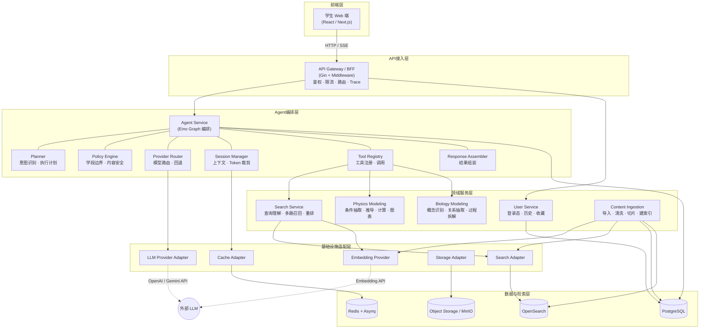
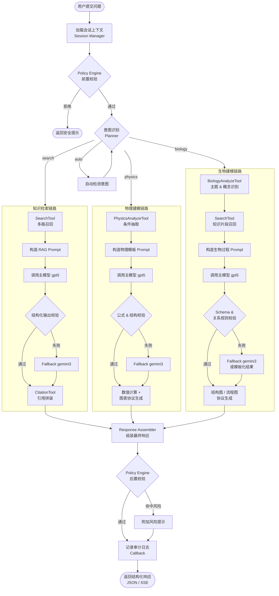
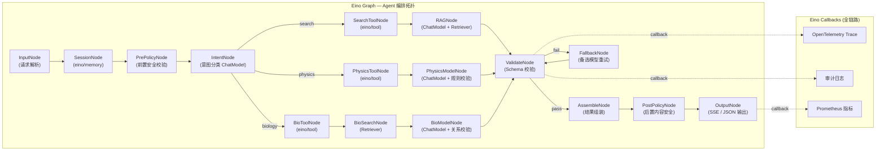

# Snowy 技术方案

## 1. 文档信息
- 项目名称：Snowy
- 文档类型：技术方案（MVP）
- 当前版本：v0.3
- 更新时间：2026-04-14
- 面向对象：后端、前端、算法、测试、运维、产品

---

## 2. 项目目标与范围

### 2.1 项目目标
Snowy 面向高中生打造一款 Web 端 AIGC 学习平台，首发能力覆盖：
- 高中知识检索
- 高中物理建模（推导 + 2D 图表 + 参数调节）
- 高中生物建模（概念识别 + 关系抽取 + 过程拆解 + 实验变量分析）

### 2.2 技术目标
围绕首发范围“知识检索 + 物理建模 + 生物建模”，构建一套以 Go 为核心后端的前后端分离系统，实现：
- 统一索引课本与考纲、题库与讲义；
- 基于 RAG 的高可信知识检索；
- 基于 Agent 编排的大模型推理与工具调用；
- 基于规则校验与结构化输出的物理推导；
- 基于关系抽取、流程表达的生物建模；
- 基于多模型路由的稳定性、质量与成本平衡；
- 基于 monorepo 的前后端协同研发与统一交付。

### 2.3 非目标
当前阶段不纳入：
- 原生移动端 App
- 3D 可视化
- 复杂动画仿真引擎
- 教师完整运营后台
- 长周期个性化推荐系统

---

## 3. 技术原则

1. **引用优先**：所有回答优先基于检索结果，不允许无依据生成。
2. **结构化优先**：检索结果、推导步骤、图表协议、关系图协议统一结构化输出。
3. **Agent 可控优先**：工具调用、模型路由、上下文管理、回退逻辑必须可观测、可审计。
4. **规则 + 模型协同**：大模型负责理解和生成，规则引擎负责校验和收敛。
5. **前后端分离**：前后端独立开发、独立部署，但放在同一 git repo。
6. **Go 社区标准优先**：遵循 `cmd`、`internal`、`api`、`configs`、`web` 等常见结构。
7. **可扩展优先**：为后续动画仿真、生物动态过程仿真、教师后台留扩展接口。
8. **生产可治理优先**：优先使用成熟、稳定、便于排障的基础设施与组件。

---

## 4. 技术调研与选型结论

## 4.1 Go 实现 Agent 服务的可行性结论
Snowy 的 Agent 服务需要解决的问题不是“通用聊天”，而是：
- 识别用户意图；
- 编排知识检索、物理建模、生物建模等工具；
- 管理多轮会话上下文；
- 对接多模型供应商；
- 执行结构化输出校验与回退；
- 全链路审计与可观测。

从工程诉求上看，**Go 非常适合实现 Snowy 的 Agent 服务控制层**，原因如下：
1. 适合高并发 API 与 I/O 密集型服务；
2. 易于构建稳定的微服务和异步任务系统；
3. 更适合生产环境中的资源控制、日志治理和服务观测；
4. 对“编排层、工具层、Provider 层”的强约束架构支持较好；
5. 在教育产品场景中，比重度依赖动态框架更容易保证可控性。

结论：**Go 作为 Agent Orchestrator / Tool Runtime / Provider Router 的实现语言是推荐方案。**

## 4.2 Agent 技术方案调研

### 方案 A：直接依赖通用轻量 Agent 框架（如 LangChainGo）
典型思路：
- 使用通用 Agent SDK 或链式框架封装工具调用与模型编排。

优点：
- Demo 搭建快；
- Prompt 链路表达方便。

缺点：
- Go 生态成熟度弱于 Python；
- 抽象偏重，生产定位与排障不够透明；
- 对结构化输出、审计日志、教育内容边界控制不够强；
- 容易形成"黑盒编排"。

结论：
- **不建议作为 Snowy 的核心生产方案**；
- 可借鉴其 prompt pipeline 思路，但不直接作为底层框架。

### 方案 B：工作流引擎驱动 Agent
典型思路：
- 使用 Temporal 等工作流框架编排长任务。

优点：
- 重试、补偿、状态恢复能力强；
- 适合长链路异步任务。

缺点：
- 基础设施复杂；
- 团队学习成本较高；
- 对 MVP 阶段偏重。

结论：
- **适合二期异步任务升级**；
- 当前 MVP 不建议作为默认基础设施。

### 方案 C：Go 完全自研 Agent Orchestrator
典型思路：
- 从零自建 Agent Service、Tool Registry、Provider Adapter、Memory 管理等全套基础设施。

优点：
- 自由度最高；
- 无任何外部框架约束。

缺点：
- 初期工程投入极高：ChatModel 对接、Tool Calling 协议、流式输出、Memory 裁剪均需从头实现；
- 需要自己维护工具协议与结构化输出解析；
- 多模型 Provider 适配工作量大且重复；
- 缺乏社区验证，生产稳定性需要更长时间打磨。

结论：
- **不建议在 MVP 阶段选择完全自研**；
- 投入产出比不如基于成熟框架扩展。

### 方案 D（推荐）：基于 Eino 框架 + 业务扩展层
典型思路：
- 采用字节跳动 CloudWeGo 团队开源的 **Eino**（`github.com/cloudwego/eino`）作为 Agent 编排基座；
- 在 Eino 提供的 ChatModel / Tool / Graph / Retriever / Memory / Callbacks 核心抽象之上，叠加 Snowy 业务层（Planner、Policy Engine、领域工具、领域校验）。

#### Eino 核心能力

| 能力 | 说明 |
|---|---|
| **ChatModel 抽象** | 统一封装 OpenAI / Gemini / Anthropic 等，天然支持 Structured Output、Tool Calling、流式 |
| **Tool / Function Calling** | 内置 Tool 注册与调用协议，支持 schema 自动生成 |
| **Graph 编排** | 有向图编排（类 LangGraph），节点可为 ChatModel / Tool / Retriever / Lambda，支持条件分支、并行、循环 |
| **Chain 编排** | 线性链路编排，适合简单 RAG pipeline |
| **Retriever 抽象** | 统一检索接口，可对接 OpenSearch / Elasticsearch / 向量库 |
| **Memory / ChatHistory** | 内置会话记忆管理，支持窗口、摘要、token 裁剪 |
| **Callbacks** | 全链路回调钩子，天然适配 OpenTelemetry / Prometheus / 审计日志 |
| **Structured Output** | 原生支持 JSON Schema 约束输出 |

#### Eino 与完全自研的对比

| 维度 | 完全自研 | Eino + 业务扩展 |
|---|---|---|
| ChatModel / Provider 对接 | 需自己封装每个厂商 SDK | Eino 已内置，开箱即用 |
| Tool Calling 协议 | 需自己定义、维护、校验 | Eino 内置 Tool 注册与 schema 生成 |
| 会话记忆管理 | 需自己实现 token 裁剪、摘要压缩 | Eino 内置 Memory 组件 |
| 流式输出 | 需自己处理 SSE / chunk 拼接 | Eino ChatModel 原生支持 |
| 链路可观测 | 需自己埋点 | Eino Callbacks 天然支持 OTel |
| 编排灵活性 | 自由度最高 | Graph 编排 + 自定义节点，灵活度足够 |
| 社区维护 | 全部自维护 | CloudWeGo 社区 + 字节内部持续投入 |
| 生产验证 | 从零验证 | 字节内部大规模生产验证 |
| MVP 交付速度 | 慢 | 快 1~2 周 |

#### Eino 如何映射到 Snowy 的 Agent 子模块

| Snowy 子模块 | Eino 对应能力 | 是否需要自研 |
|---|---|---|
| `Planner` | Eino Graph 节点 + 条件路由 | **业务层自研**，Eino 提供 Graph 骨架 |
| `Tool Registry` | `eino/tool` | **直接使用**，自定义业务工具即可 |
| `Session Manager` | `eino/memory` | **直接使用**，按需扩展 Redis 持久化 |
| `Policy Engine` | Eino Callback + 自定义中间件 | **业务层自研** |
| `Provider Router` | `eino/model` + 自定义路由逻辑 | **半自研**：Eino 提供 ChatModel 抽象，路由逻辑自写 |
| `Response Assembler` | Eino Graph 的终端节点 | **业务层自研** |

优点：
- Eino 承担 80% 的 AI 基础设施工作（ChatModel、Tool、Memory、流式、回调）；
- Snowy 团队只需聚焦 20% 的业务差异化层（Planner、Policy、领域工具、领域校验）；
- Eino 与 Gin 可正常共存，不强制绑定 Hertz；
- Eino 的 Graph 编排比纯 Chain 更适合 Snowy 的多分支场景（search / physics / biology）；
- 字节内部大规模生产验证，稳定性有保障。

缺点：
- 对 CloudWeGo 生态有一定依赖；
- 团队需学习 Eino 的 Graph / Callback 编程模型。

结论：
- **推荐作为 Snowy 的正式技术选型。**

#### Eino 依赖引入

```text
go.mod:
  github.com/cloudwego/eino          // 核心
  github.com/cloudwego/eino-ext      // 扩展（OpenAI/Gemini provider、OpenSearch retriever 等）
```

## 4.3 最终选型结论
Snowy 采用：

- **Eino (CloudWeGo) 作为 Agent 编排基座 + 业务扩展层**
- **Eino ChatModel / Tool / Graph / Memory / Callbacks 作为 AI 基础设施**
- **Search / Physics / Biology 独立领域服务**
- **Redis + Asynq 作为异步任务机制**
- **OpenSearch 承担全文 + 向量 + 混合检索**
- **前后端分离 + 同仓 monorepo**

---

## 5. 总体架构

### 5.1 架构概览
Snowy 采用前后端分离架构，但前端与后端代码放在同一个 git repo 中统一管理。

#### 架构总览图



整体分层如下：

1. **前端层**
   - 学生 Web 端
   - 负责页面渲染、交互状态、图表渲染、关系图/流程图渲染

2. **API 接入层**
   - API Gateway / BFF
   - 统一鉴权、限流、路由、聚合响应、Trace 注入

3. **Agent 编排层**
   - Agent Service（基于 Eino Graph 编排）
   - 负责意图识别、工具选择、模型路由、上下文管理、结果组装

4. **领域服务层**
   - Search Service
   - Physics Modeling Service
   - Biology Modeling Service
   - User Service
   - Content Ingestion Service

5. **基础设施适配层**
   - LLM Provider Adapter
   - Embedding Provider
   - Search Adapter
   - Storage Adapter
   - Cache Adapter

6. **数据与检索层**
   - PostgreSQL
   - Redis
   - OpenSearch
   - Object Storage

### 5.2 前后端分离与同仓策略
本项目支持：
- 前后端分离开发；
- 前后端独立构建；
- 前后端独立部署；
- API 契约统一维护；
- 文档、代码、配置、CI/CD 同仓管理。

结论：
- 架构上是**前后端分离**；
- 工程组织上是**同一 git repo 的 monorepo**。

---

## 6. 技术栈选型

## 6.1 后端技术栈

### 6.1.1 Go 版本
- **Go 1.24+**

原因：
- 性能稳定；
- 标准库能力成熟；
- 适合高并发 API 服务和异步 worker。

### 6.1.2 HTTP 框架
- **Gin**

备选：
- Echo
- Chi
- Hertz（CloudWeGo，若团队对 CloudWeGo 生态接受度高，可考虑与 Eino 形成更一致的技术栈）

选择原因：
- 社区成熟度高；
- 中间件生态丰富；
- 团队上手成本低；
- 对 MVP 交付友好；
- Eino 与 Gin 可正常共存，不强制绑定 Hertz。

### 6.1.3 配置管理
- **Viper + 环境变量**

原因：
- 同时支持本地配置文件、环境变量、容器部署；
- 适合多环境配置切换。

### 6.1.4 日志
- **标准库 `log/slog`**

原因：
- 标准库方案；
- 长期维护成本低；
- 易于统一结构化日志输出。

### 6.1.5 参数校验
- **go-playground/validator**

原因：
- Go 社区事实标准；
- 与 HTTP 入参绑定配合成熟。

### 6.1.6 数据库访问
- **pgx + sqlc**

备选：
- GORM
- sqlx

选择原因：
- 类型安全；
- SQL 显式、便于优化；
- 对复杂查询更稳定；
- 比 ORM 更适合检索和建模类服务。

### 6.1.7 数据迁移
- **golang-migrate**

### 6.1.8 缓存与异步任务
- **Redis + Asynq**

原因：
- MVP 阶段足够稳定；
- 支持任务重试、延迟执行、失败队列；
- 适合内容入库、批量索引、复杂图生成等异步场景。

## 6.2 检索与存储技术栈

### 6.2.1 主数据库
- **PostgreSQL**

用于：
- 用户数据
- 会话数据
- Agent 运行记录
- 内容元数据
- 建模结果快照

### 6.2.2 搜索引擎
- **OpenSearch**

用于：
- 全文检索
- 向量检索
- 混合检索
- 标签过滤
- 题库相似题召回

选择原因：
- 减少双引擎复杂度；
- 统一全文与向量能力；
- 更适合知识检索主场景。

### 6.2.3 对象存储
- **S3 兼容对象存储 / MinIO（开发环境）**

用于：
- 原始内容文件
- 图表快照
- 结构图导出文件
- 异步生成中间产物

## 6.3 LLM 与 AI 侧选型

### 6.3.1 主推理模型
- **`gpt5`**

用途：
- 高复杂度推理
- 结构化输出
- 物理推导
- 生物关系抽取

### 6.3.2 备选模型
- **`gemini3`**

用途：
- 主模型超时或失败时回退；
- 成本兜底；
- 灰度对照。

### 6.3.3 Embedding 模型
- **推荐方案**：OpenAI `text-embedding-3-large`（1536/3072 维）
- **备选方案**：开源 BGE-M3（支持多语言、多粒度，可自部署）

选型原则：
- 独立 Embedding 能力，不与主推理模型强耦合；
- Embedding 维度需与 OpenSearch 向量索引配置对齐；
- 通过 Eino Embedding Provider 统一封装调用；
- 后续可按成本或性能需要切换模型，不影响上层业务。

### 6.3.4 Provider 封装策略
所有模型调用必须通过统一 `Provider Adapter`：
- 屏蔽厂商 SDK 差异；
- 统一超时、重试、限流、日志、审计；
- 统一成本统计和错误码。

## 6.4 前端技术栈
- TypeScript
- React / Next.js
- Zustand
- ECharts / Recharts（物理图表）
- React Flow / AntV X6（生物关系图 / 流程图）

### 6.4.1 SSR 策略
- 首发阶段使用 **CSR（Client Side Rendering）**，不引入 SSR 复杂度；
- 面向学生的学习工具场景，SEO 需求较低；
- 后续若需要公开知识页面的 SEO 能力，可按需对特定路由启用 ISR / SSR。

## 6.5 可观测与运维
- OpenTelemetry
- Prometheus
- Grafana
- Loki / ELK
- Docker
- Kubernetes（后续）

---

## 7. Go 项目工程结构（社区标准）

## 7.1 设计原则
遵循 Go 社区常见实践：
- 可执行入口放 `cmd/`
- 核心业务放 `internal/`
- 对外契约放 `api/`
- 前端项目放 `web/`
- 配置与部署独立目录管理
- 默认不滥用 `pkg/`

## 7.2 推荐目录结构
```text
snowy/
  cmd/
    api/                       # HTTP API 入口
    worker/                    # 异步任务 Worker 入口

  internal/
    app/                       # 应用装配与启动
    config/                    # 配置加载
    middleware/                # HTTP 中间件
    handler/
      http/                    # HTTP handler / DTO

    agent/                     # Agent 编排域（基于 Eino）
      graph/                   # Eino Graph 定义（编排拓扑）
      node/                    # 自定义 Graph 节点
      tool/                    # 业务工具实现（SearchTool, PhysicsTool 等）
      policy/                  # 安全/学段/内容边界策略
      router/                  # 模型路由（基于 Eino ChatModel 扩展）
      callback/                # 审计、OTel、日志等回调
      assembler/               # 结果组装

    search/                    # 知识检索域
      service/
      repository/
      ranking/
      query/

    modeling/
      physics/                 # 物理建模域
        service/
        domain/
        calculator/
        renderer/
      biology/                 # 生物建模域
        service/
        domain/
        extractor/
        graph/
        experiment/

    user/
      service/
      repository/

    content/                   # 内容入库域
      ingest/
      parser/
      chunker/
      indexer/

    provider/                  # 外部能力适配层
      llm/
      embedding/
      search/
      storage/

    store/                     # DB / Redis 等底层访问
      postgres/
      redis/

    common/                    # 仅存放真正跨域的小工具

  api/
    openapi/                   # OpenAPI 契约
    proto/                     # 若后续引入 gRPC

  web/
    snowy-web/               # 前端项目

  configs/
    config.yaml
    config.local.yaml
    config.prod.yaml

  deployments/
    docker/
    k8s/

  scripts/
    dev.sh
    lint.sh
    test.sh

  test/
    integration/
    e2e/

  docs/
    prd.md
    tech-solution.md

  go.mod
  Makefile
  README.md
```

## 7.3 结构说明
- `cmd/api`：API 服务启动入口
- `cmd/worker`：异步任务 worker 启动入口
- `internal/agent`：Agent 编排逻辑核心
- `internal/search`：检索业务实现
- `internal/modeling/physics`：物理建模实现
- `internal/modeling/biology`：生物建模实现
- `api/openapi`：前后端共享 API 契约
- `web/snowy-web`：前端独立应用
- `deployments/`：容器与 K8s 部署文件
- `configs/`：多环境配置

## 7.4 关于 `pkg/`
默认**不创建 `pkg/`**。
只有当某个包确定需要被外部复用时，才考虑抽离到 `pkg/`。

---

## 8. 前后端分离 + 同仓 monorepo 方案

## 8.1 目标
在保持前后端独立开发、独立部署的前提下，使用同一 git repo 管理：
- 前端代码
- 后端代码
- OpenAPI 契约
- 文档
- CI/CD 配置

## 8.2 设计原则
1. 前端与后端目录物理分离；
2. API 契约统一管理；
3. CI 支持按目录变更触发；
4. 构建产物独立；
5. 部署链路独立。

## 8.3 协作边界
- 后端负责提供 OpenAPI 契约与服务实现；
- 前端基于 OpenAPI 生成类型或校验请求模型；
- 文档更新与接口变更必须同一个 PR 提交。

## 8.4 构建与部署策略
- 后端：
  - 构建 Go 二进制 / Docker 镜像
  - 独立部署到容器平台
- 前端：
  - 构建静态产物
  - 部署到 CDN / 静态站点平台

## 8.5 CI 建议
按路径触发：
- `internal/**`、`cmd/**` 变更 -> Go lint/test/build
- `web/**` 变更 -> 前端 lint/test/build
- `api/openapi/**` 变更 -> 前后端契约校验
- `docs/**` 变更 -> 文档校验

---

## 9. 核心服务拆分

## 9.1 API Gateway / BFF
职责：
- 统一入口
- JWT / Session 鉴权
- 限流
- Trace 注入
- 请求 ID 生成
- 聚合响应
- 灰度流量控制

## 9.2 Agent Service
职责：
- 用户意图识别
- 执行计划生成
- 多轮会话管理
- 工具调用编排
- 模型路由与回退
- 结构化输出校验
- 最终结果组装

子模块：
- `Planner`
- `Tool Registry`
- `Session Manager`
- `Policy Engine`
- `Provider Router`
- `Response Assembler`

## 9.3 Search Service
职责：
- 查询理解
- 多路召回
- 结果重排
- 引用拼装
- 检索日志记录

## 9.4 Physics Modeling Service
职责：
- 条件抽取
- 模型识别
- 推导步骤生成
- 数值计算
- 图表协议生成
- 参数校验

## 9.5 Biology Modeling Service
职责：
- 主题识别
- 概念识别
- 概念关系抽取
- 过程拆解
- 实验变量分析
- 关系图/流程图协议生成

## 9.6 User Service
职责：
- 登录态管理
- 历史记录
- 收藏
- 学习行为记录

## 9.7 Content Ingestion Service
职责：
- 内容导入
- 清洗
- 切片
- 标签化
- 建索引
- 数据版本管理

---

## 10. Agent 服务设计

## 10.1 Agent Service 定位
Agent Service 是 Snowy 的智能编排中枢，负责把用户请求转为一条可控的执行链路，而不是简单调用单个模型。

## 10.2 Agent 处理流程
1. 接收用户问题；
2. 判断模式：
   - `search`
   - `physics`
   - `biology`
   - `auto`
3. 加载上下文；
4. 生成执行计划；
5. 调用工具；
6. 调用模型；
7. 校验结构化结果；
8. 组装最终响应；
9. 记录审计日志。

#### Agent 主处理流程图



## 10.3 Tool Registry 设计
内置工具建议包括：
- `SearchTool`
- `PhysicsAnalyzeTool`
- `PhysicsSimulateTool`
- `BiologyAnalyzeTool`
- `CitationTool`
- `HistoryTool`

每个工具统一定义：
- 输入 schema
- 输出 schema
- 超时配置
- 重试策略
- 审计策略

## 10.4 Session Manager 设计
职责：
- 管理会话上下文；
- 历史摘要压缩；
- 控制上下文 token 长度；
- 绑定用户会话与模型调用链。

## 10.5 Policy Engine 设计
职责：
- 控制学段边界；
- 控制未成年人场景内容安全；
- 限制超纲实验输出；
- 对低可信内容附加风险提示。

## 10.6 同步与异步模式
### 同步模式
用于：
- 普通知识检索
- 单次物理分析
- 单次生物分析

### 异步模式
用于：
- 批量入库
- 批量图谱生成
- 长文本内容处理
- 重型内容清洗任务

异步建议使用：
- `Asynq Worker`

## 10.7 Eino Graph 拓扑总览

以下展示 Agent Service 内部基于 Eino Graph 的节点编排拓扑，每个方框对应一个 Eino Graph Node。



#### 节点与 Eino 组件映射

| Graph Node | Eino 组件 | 自研程度 |
|---|---|---|
| `InputNode` | 自定义 Lambda | 业务自研 |
| `SessionNode` | `eino/memory` | 直接使用 |
| `PrePolicyNode` / `PostPolicyNode` | Eino Callback + 自定义中间件 | 业务自研 |
| `IntentNode` | `eino/model` ChatModel + Structured Output | 半自研（Prompt 自写） |
| `SearchToolNode` / `PhysicsToolNode` / `BioToolNode` | `eino/tool` | 直接使用，工具实现自研 |
| `RAGNode` | `eino/model` + `eino/retriever` | 直接使用 |
| `ValidateNode` | 自定义 Lambda | 业务自研 |
| `FallbackNode` | `eino/model` + 自定义路由 | 半自研 |
| `AssembleNode` | 自定义 Lambda | 业务自研 |
| `OutputNode` | 自定义 Lambda（桥接 Gin SSE） | 业务自研 |

---

## 11. 核心业务链路

## 11.1 知识检索链路
1. 前端提交 query、filters、session_id；
2. API Gateway 鉴权并路由到 Agent Service；
3. Agent 判断为 `search` 或 `auto -> search`；
4. Search Service 执行全文、向量、标签、题库多路召回；
5. Search Service 返回候选结果与引用片段；
6. Agent 构造 RAG prompt；
7. 优先调用 `gpt5` 生成结构化答案；
8. 若主模型失败或质量不足，切换 `gemini3`；
9. 返回 `answer + citations + knowledge_tags + related_questions + confidence`。

## 11.2 物理建模链路
1. 前端提交题目文本或问题描述；
2. Agent 判断为 `physics`；
3. Physics Modeling Service 抽取条件、单位、已知/未知量；
4. Agent 基于物理模板组织 prompt；
5. 模型输出推导草案；
6. Physics Modeling Service 做结构校验和公式校验；
7. 计算模块生成数值结果与 2D 图表协议；
8. 用户调节参数时，优先走计算链路，不重复调用大模型。

## 11.3 生物建模链路
1. 前端提交知识点描述、过程问题或实验题；
2. Agent 判断为 `biology`；
3. Biology Modeling Service 识别主题、章节、核心概念；
4. Search Service 召回相关课本、考纲、题库与讲义片段；
5. Agent 组织生物过程 prompt；
6. 模型输出概念、关系、过程阶段与实验变量；
7. Biology Modeling Service 做 schema 校验、关系规则校验；
8. 输出结构图/流程图协议；
9. 若关系冲突或结构异常，则回退到备选模型或模板化结果。

## 11.4 检索跳转建模链路
1. 用户在知识检索结果页点击“进入物理建模”或“进入生物建模”；
2. 前端携带 query、citations、knowledge_tags 跳转；
3. Agent 读取上下文并进入对应建模模式；
4. 降低重复检索成本并提高回答连贯性。

---

## 12. 统一索引与内容入库方案

## 12.1 数据源范围
统一接入：
- 课本
- 考纲
- 题库
- 讲义

## 12.2 数据标准化
统一文档结构：
- `doc_id`
- `source_type`
- `subject`
- `grade`
- `chapter`
- `section`
- `knowledge_tags`
- `topic_tags`
- `difficulty`
- `content`
- `answer`
- `metadata`
- `copyright_status`
- `version`

## 12.3 切片策略
- 课本/讲义：按段落、小节切片
- 考纲：按知识项、能力要求切片
- 题库：按题干、答案、解析切片
- 生物内容：按概念、过程阶段、实验要素切片

## 12.4 索引策略
- 全文索引：关键词召回
- 向量索引：语义召回
- 标签索引：学科/章节/知识点过滤
- 相似题索引：题库推荐
- 概念关系索引：生物图谱与流程图生成辅助

## 12.5 入库流程
1. 原始内容导入；
2. 内容清洗；
3. 结构化标签提取；
4. 文本切片；
5. embedding 生成；
6. OpenSearch 建索引；
7. 元数据写入 PostgreSQL；
8. 构建版本记录与可追踪性。

---

## 13. RAG 与 Prompt 编排设计

## 13.1 RAG 目标
确保所有回答尽量“基于证据生成”，而不是“凭空生成”。

## 13.2 Prompt 设计原则
- 优先使用检索结果内容；
- 必须输出固定结构；
- 回答语言适配高中生；
- 必须区分“引用事实”和“模型总结”；
- 生物场景必须明确概念、关系、阶段、变量。

## 13.3 知识检索输出协议
```json
{
  "answer": "string",
  "knowledge_tags": ["string"],
  "citations": [
    {
      "doc_id": "string",
      "source_type": "string",
      "snippet": "string",
      "score": 0.98
    }
  ],
  "related_questions": [
    {
      "id": "string",
      "title": "string"
    }
  ],
  "confidence": 0.91
}
```

## 13.4 低可信回退策略
触发条件：
- 引用不足；
- 召回分数过低；
- 主模型超时；
- 输出结构不合法；
- 领域规则校验失败。

回退动作：
1. 降级为检索结果直出 + 最小摘要；
2. `gpt5 -> gemini3`；
3. 附加“可信度不足”提示；
4. 记录审计日志和回退原因。

---

## 14. 模型路由策略

## 14.1 当前策略
- 主推理模型：`gpt5`
- 备选模型：`gemini3`

## 14.2 路由规则
1. 默认优先走 `gpt5`；
2. 以下情况切换 `gemini3`：
   - 调用失败；
   - 超时；
   - 输出结构校验失败；
   - 预算阈值超限；
3. 高风险场景必须做领域校验：
   - 物理推导；
   - 生物关系抽取；
   - 实验变量识别。

## 14.3 Provider 抽象接口
建议统一定义：
- `Generate(ctx, request) (response, error)`
- `HealthCheck(ctx) error`
- `EstimateCost(ctx, request) (cost, error)`

## 14.4 路由伪代码
```text
if task_type in [search_answer, physics_derivation, biology_modeling]:
    try gpt5
    validate schema
    validate citations
    validate domain rules
    if pass:
        return result
    else:
        fallback gemini3
else:
    route by config
```

---

## 15. 物理建模设计

## 15.1 目标
将自然语言题目转为结构化物理模型，并生成可校验、可渲染、可调参的结果。

## 15.2 分层
1. 语义层：理解题意
2. 规则层：识别物理模型与公式
3. 推理层：生成推导步骤
4. 计算层：计算数值结果
5. 可视化层：输出图表协议

## 15.3 输出协议
```json
{
  "model_type": "projectile_motion",
  "conditions": [
    {"name": "v0", "value": 20, "unit": "m/s"}
  ],
  "steps": [
    {
      "index": 1,
      "title": "建立水平方向位移公式",
      "content": "x = v0 * t"
    }
  ],
  "result_summary": "...",
  "warnings": ["忽略空气阻力"]
}
```

## 15.4 2D 图表协议
```json
{
  "chart_type": "line",
  "title": "位移-时间图像",
  "x_axis": {"label": "t", "unit": "s"},
  "y_axis": {"label": "x", "unit": "m"},
  "series": [
    {
      "name": "位移",
      "data": [[0, 0], [1, 20], [2, 40]]
    }
  ]
}
```

## 15.5 参数调节
后端返回参数 schema：
- 参数名
- 默认值
- 最小值
- 最大值
- 步长
- 单位

调参优先走轻量计算接口，而非重复请求 LLM。

---

## 16. 生物建模设计

## 16.1 目标
将自然语言问题、实验题、知识点描述转为结构化生物模型，并输出适合高中生理解的概念、关系、过程、变量结果。

## 16.2 分层
1. 语义层：识别主题、章节、概念实体
2. 知识层：召回相关知识片段
3. 关系层：抽取概念关系
4. 过程层：拆解过程阶段
5. 可视化层：输出流程图/关系图协议

## 16.3 输出协议
```json
{
  "topic": "photosynthesis",
  "concepts": [
    {"name": "光照强度", "type": "factor"},
    {"name": "有机物积累", "type": "result"}
  ],
  "relations": [
    {"source": "光照强度", "target": "有机物积累", "type": "influences"}
  ],
  "process_steps": [
    {
      "index": 1,
      "title": "识别限制因素",
      "content": "当其他条件稳定时，光照强度影响光反应效率"
    }
  ],
  "experiment_variables": {
    "independent": ["光照强度"],
    "dependent": ["有机物积累量"],
    "controlled": ["温度", "二氧化碳浓度"]
  },
  "result_summary": "..."
}
```

## 16.4 结构图 / 流程图协议
```json
{
  "diagram_type": "flow",
  "title": "光合作用影响因素流程图",
  "nodes": [
    {"id": "n1", "label": "光照强度", "type": "factor"},
    {"id": "n2", "label": "有机物积累", "type": "result"}
  ],
  "edges": [
    {"source": "n1", "target": "n2", "label": "影响"}
  ]
}
```

## 16.5 实验变量分析
规则要求：
- 必须区分自变量、因变量、控制变量；
- 禁止把背景条件误识别为变量；
- 对缺失条件的题目给出“需补充实验条件”提示；
- 默认不输出超纲实验指导。

---

## 17. API 设计建议

## 17.1 Agent 会话接口
`POST /api/v1/agent/chat`

用途：
- 首页问答统一入口
- 多轮会话
- 自动模式路由

请求示例：
```json
{
  "session_id": "sess_xxx",
  "message": "光合作用中光照强度变化如何影响有机物积累",
  "mode": "auto",
  "filters": {
    "subject": "biology",
    "grade": "high_school"
  }
}
```

响应示例：
```json
{
  "mode": "biology",
  "answer": "...",
  "citations": [],
  "tool_calls": [],
  "structured_payload": {},
  "confidence": 0.91,
  "next_actions": []
}
```

## 17.2 搜索接口
`POST /api/v1/search/query`

## 17.3 物理解析接口
`POST /api/v1/modeling/physics/analyze`

## 17.4 物理调参接口
`POST /api/v1/modeling/physics/simulate`

## 17.5 生物建模解析接口
`POST /api/v1/modeling/biology/analyze`

## 17.6 Agent 会话管理接口
- `POST /api/v1/agent/sessions`
- `GET /api/v1/agent/sessions/{id}`
- `GET /api/v1/agent/sessions/{id}/messages`

## 17.7 收藏与历史接口
- `GET /api/v1/history`
- `POST /api/v1/favorites`

## 17.8 流式输出（SSE）设计

Agent 会话接口 `POST /api/v1/agent/chat` 同时支持流式响应：
- 请求头携带 `Accept: text/event-stream` 时进入流式模式；
- Eino ChatModel 原生支持 streaming，后端桥接到 Gin 的 SSE response。

SSE Event 协议：
```text
event: thinking
data: {"content": "正在检索相关知识点..."}

event: content
data: {"content": "牛顿第二定律表述为..."}

event: citation
data: {"doc_id": "doc_001", "snippet": "...", "score": 0.95}

event: tool_call
data: {"tool": "SearchTool", "status": "completed"}

event: chart
data: {"chart_type": "line", "title": "位移-时间图像", ...}

event: done
data: {"confidence": 0.92, "token_usage": {"input": 1200, "output": 800}}
```

设计要点：
- 每个 event 必须包含 `event` 类型和 `data` JSON 负载；
- `done` 事件标志流结束，携带完整元数据；
- 前端根据 event 类型渐进渲染不同区域；
- 非流式模式直接返回完整 JSON 响应。

## 17.9 统一错误码体系

所有 API 统一使用结构化错误响应：
```json
{
  "code": "SEARCH_NO_RESULT",
  "message": "未找到相关结果，请尝试更换关键词",
  "request_id": "req_xxx"
}
```

核心错误码定义：

| 错误码 | HTTP 状态码 | 说明 |
|---|---|---|
| `OK` | 200 | 成功 |
| `INVALID_INPUT` | 400 | 请求参数不合法 |
| `UNAUTHORIZED` | 401 | 未认证 |
| `FORBIDDEN` | 403 | 无权限 |
| `SEARCH_NO_RESULT` | 200 | 检索无有效结果（业务正常） |
| `MODEL_TIMEOUT` | 504 | 大模型调用超时 |
| `MODEL_UNAVAILABLE` | 503 | 大模型服务不可用 |
| `SCHEMA_VALIDATION_FAILED` | 502 | 模型输出结构校验失败 |
| `LOW_CONFIDENCE` | 200 | 结果可信度不足（业务正常，附带提示） |
| `CONDITION_INSUFFICIENT` | 200 | 题干条件不足，需补充 |
| `RATE_LIMITED` | 429 | 请求频率超限 |
| `INTERNAL_ERROR` | 500 | 服务内部错误 |

前端展示策略：
- `LOW_CONFIDENCE`、`SEARCH_NO_RESULT`、`CONDITION_INSUFFICIENT`：展示友好提示 + 降级内容；
- `MODEL_TIMEOUT`、`MODEL_UNAVAILABLE`：展示"服务繁忙"提示 + 重试按钮；
- `RATE_LIMITED`：展示"请求过于频繁"提示。

---

## 18. 数据库与存储设计

## 18.1 PostgreSQL 核心表
- `users`
- `search_sessions`
- `search_logs`
- `content_documents`
- `content_chunks`
- `physics_models`
- `physics_runs`
- `biology_models`
- `biology_runs`
- `concept_graph_snapshots`
- `agent_sessions`
- `agent_messages`
- `agent_runs`
- `agent_tool_calls`
- `favorites`

## 18.2 表说明
- `content_documents`：原始文档元信息
- `content_chunks`：切片内容与索引字段
- `search_logs`：检索行为日志
- `physics_runs`：物理建模运行结果
- `biology_runs`：生物建模运行结果
- `concept_graph_snapshots`：关系图/流程图快照
- `agent_sessions`：Agent 会话
- `agent_messages`：对话消息
- `agent_runs`：一次 Agent 执行记录
- `agent_tool_calls`：工具调用记录

### 18.2.1 核心表字段设计

**`agent_sessions`**

| 字段 | 类型 | 说明 |
|---|---|---|
| `id` | UUID | 主键 |
| `user_id` | UUID | 用户 ID |
| `mode` | VARCHAR(32) | 会话模式（search / physics / biology / auto） |
| `status` | VARCHAR(16) | 状态（active / closed） |
| `metadata` | JSONB | 扩展元数据 |
| `created_at` | TIMESTAMPTZ | 创建时间 |
| `updated_at` | TIMESTAMPTZ | 更新时间 |

**`agent_runs`**

| 字段 | 类型 | 说明 |
|---|---|---|
| `id` | UUID | 主键 |
| `session_id` | UUID | 关联会话 |
| `message_id` | UUID | 触发消息 ID |
| `mode` | VARCHAR(32) | 执行模式 |
| `model_name` | VARCHAR(64) | 使用的模型 |
| `prompt_version` | VARCHAR(32) | Prompt 模板版本 |
| `input_tokens` | INT | 输入 token 数 |
| `output_tokens` | INT | 输出 token 数 |
| `estimated_cost` | DECIMAL(10,6) | 预估成本（美元） |
| `latency_ms` | INT | 耗时（毫秒） |
| `confidence` | DECIMAL(4,3) | 置信度 |
| `fallback_reason` | VARCHAR(128) | 回退原因（可为空） |
| `status` | VARCHAR(16) | 状态（success / failed / fallback） |
| `error_code` | VARCHAR(64) | 错误码（可为空） |
| `created_at` | TIMESTAMPTZ | 创建时间 |

**`agent_tool_calls`**

| 字段 | 类型 | 说明 |
|---|---|---|
| `id` | UUID | 主键 |
| `run_id` | UUID | 关联 run |
| `tool_name` | VARCHAR(64) | 工具名称 |
| `input` | JSONB | 工具输入 |
| `output` | JSONB | 工具输出 |
| `latency_ms` | INT | 耗时 |
| `status` | VARCHAR(16) | 状态 |
| `created_at` | TIMESTAMPTZ | 创建时间 |

## 18.3 Redis 用途
- 热点问题缓存
- 会话上下文缓存
- 限流计数
- 短期模型结果缓存
- 生物图模板缓存
- Asynq 任务队列

### 18.3.1 缓存 TTL 策略

| 缓存类型 | Key 格式 | TTL | 说明 |
|---|---|---|---|
| 热点问题缓存 | `cache:search:{query_hash}` | 1h | 高频查询结果缓存 |
| 会话上下文 | `session:{session_id}:ctx` | 30min（滑动窗口） | 每次访问续期 |
| 模型结果缓存 | `cache:model:{request_hash}` | 5min | 短期避免重复调用 |
| 生物图模板 | `cache:bio:tpl:{topic}` | 24h | 概念关系模板 |
| 限流计数 | `rate:{user_id}:{window}` | 1min / 1h | 按窗口自动过期 |

---

## 18A. 鉴权设计

### 18A.1 认证方案
- 采用 **JWT（access_token + refresh_token）** 方案：
  - `access_token` 有效期 30 分钟；
  - `refresh_token` 有效期 7 天；
  - Token 中包含 `user_id`、`role`、`exp`。

### 18A.2 登录方式
- 首发支持 **手机号 + 验证码** 登录；
- 后续可扩展微信登录、邮箱登录；
- 账号体系独立，不依赖第三方平台。

### 18A.3 匿名试用
- 未登录用户允许匿名试用：
  - 按 IP 或设备指纹生成临时 session；
  - 匿名用户限制每日请求次数（如 10 次）；
  - 匿名会话数据不持久化。

### 18A.4 频率限制
- 已认证用户：60 次/分钟；
- 匿名用户：10 次/分钟；
- 全局：大模型调用总 QPS 上限（按部署容量设定）；
- 使用 Redis 滑动窗口实现。

---

## 18B. Token 预算与成本管控

### 18B.1 目标
控制 LLM 调用成本，防止单次请求或单用户消耗失控。

### 18B.2 预算层级

| 层级 | 说明 | 限额示例 |
|---|---|---|
| 单次请求 | 单次 Agent 执行的 token 上限 | input 4K + output 4K |
| 单会话 | 一个 session 内累积 token | 50K |
| 单用户/日 | 用户每日 token 总消耗 | 200K |
| 全局/小时 | 系统级每小时 token 总消耗 | 按部署预算设定 |

### 18B.3 实现方式
- 请求前：通过 Eino `EstimateTokenCount` 预估 input tokens，若超限则拒绝或裁剪上下文；
- 请求后：记录 `input_tokens` + `output_tokens` 到 `agent_runs` 表；
- 统计：按用户/会话/全局维度在 Redis 中做累计计数；
- 告警：在 `§20 可观测性` 中增加 token 消耗指标和成本告警。

### 18B.4 超限策略
- 单次超限：压缩上下文或截断历史，不直接拒绝；
- 用户日限超限：返回 `RATE_LIMITED` 错误码，提示"今日额度已用完"；
- 全局超限：触发降级策略，优先切换低成本模型。

---

## 18C. Prompt 版本管理

### 18C.1 目标
实现 Prompt 模板的版本化、灰度和回滚能力，支持质量持续优化。

### 18C.2 存储方式
- Prompt 模板存储在 **配置文件 + DB** 中：
  - 静态模板放在 `configs/prompts/` 目录，按场景分文件；
  - DB 中维护版本元数据：`prompt_templates` 表。

### 18C.3 版本化字段

| 字段 | 类型 | 说明 |
|---|---|---|
| `id` | UUID | 主键 |
| `scene` | VARCHAR(64) | 场景（search / physics / biology） |
| `version` | VARCHAR(32) | 版本号（如 v1.0、v1.1） |
| `template` | TEXT | 模板内容 |
| `status` | VARCHAR(16) | 状态（active / gray / archived） |
| `traffic_pct` | INT | 灰度流量百分比（0~100） |
| `created_at` | TIMESTAMPTZ | 创建时间 |

### 18C.4 灰度与回滚
- 新版本上线时设为 `gray` 状态，分配 10%~50% 流量；
- Agent 执行时根据 `traffic_pct` 做加权随机选择；
- `agent_runs` 中记录每次使用的 `prompt_version`；
- 通过质量评测对比新旧版本指标，决定全量切换或回滚。

---

## 20. 可观测性设计

## 20.1 指标监控
- QPS
- 接口耗时 P50 / P95 / P99
- Agent 首轮响应耗时
- Agent 完整执行耗时
- 模型成功率
- 模型回退率
- Tool 调用成功率
- 引用覆盖率
- 图表刷新耗时
- 生物关系抽取成功率
- 流程图渲染成功率
- Token 消耗（input / output / total，按模型、按用户、按全局）
- LLM 调用成本（按模型、按场景）
- Prompt 版本分布与各版本质量指标

## 20.2 追踪与审计
- 全链路 Trace ID 传播
- 关键路径日志埋点
- Agent 执行与工具调用审计
- 模型输入输出审计
- 错误与异常情况自动记录

## 20.3 告警规则
- `gpt5` 连续失败率超阈值
- `gemini3` 回退率异常升高
- Agent 结构化输出校验失败率升高
- 生物关系抽取失败率升高
- 检索引用覆盖率下降
- 核心接口 P95 超时
- 单用户/全局 Token 消耗接近预算上限
- LLM 调用日成本超预算阈值

---

## 24. 技术结论

Snowy 首发阶段推荐采用：

- **Go 作为核心后端语言**
- **Eino (CloudWeGo) 作为 Agent 编排基座 + 业务扩展层**
- **Gin 作为 HTTP 框架**
- **pgx + sqlc 作为数据库访问方案**
- **Redis + Asynq 作为缓存与异步任务机制**
- **OpenSearch 作为统一检索引擎**
- **`gpt5` 主推理、`gemini3` 备选**
- **OpenAI `text-embedding-3-large` 作为首选 Embedding 模型**
- **JWT 鉴权 + Redis 滑动窗口限流**
- **SSE 流式输出 + 统一错误码体系**
- **Token 预算管控 + Prompt 版本管理**
- **前后端分离 + 同仓 monorepo + CSR 首发**
- **Go 社区标准目录：`cmd + internal + api + configs + web + deployments + docs`**

该方案兼顾：
- 工程可控性
- 生产稳定性
- 教育内容可信度
- 团队协作效率
- 成本可治理性
- 后续扩展能力

是当前 Snowy 在 MVP 到首个正式版本阶段的推荐技术路线。
